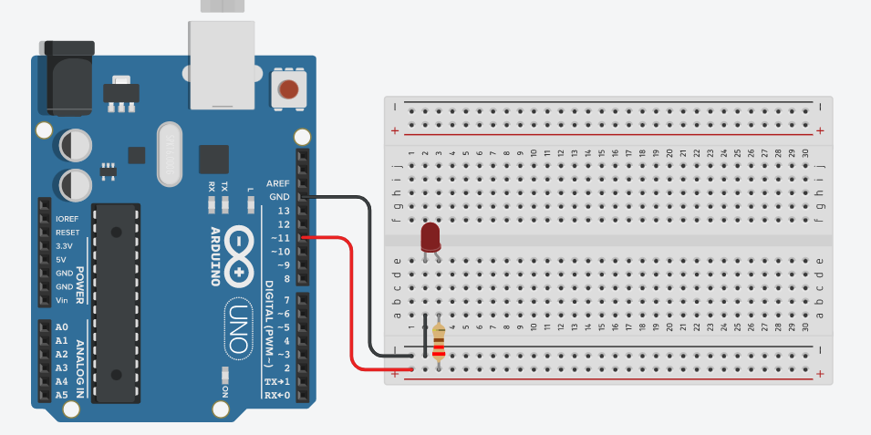

# Projeto Arduíno para piscar o led incorporado v1.

## Contextualização

-Neste experimento você irá fazer com que o LED conectado na porta digital 11 (PMW) aumente
gradativamente o brilho no intervalo de 0 a 255 em passo 5. 

## Esquema do projeto

